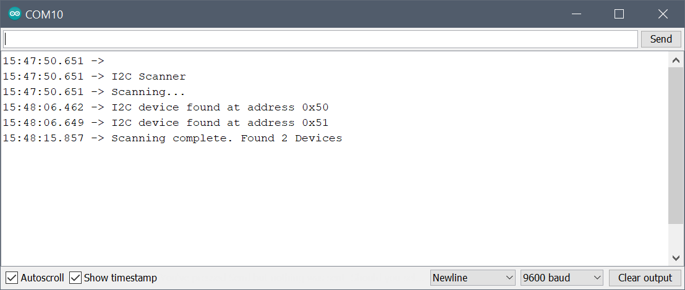

## XIAO-PMOD1-I2C24IO

Arduino Sketch for designs based on the I2C EEPROM PMOD using the M24M01 circuit by STMicroelectronics. Implemented and tested on a PMOD2RPI interface board with a Seeeduino XIAO (Cortex M0+) and a PMOD-EEPROM module. 

### Usage

Running the sketch will output the following to the serial monitor:

