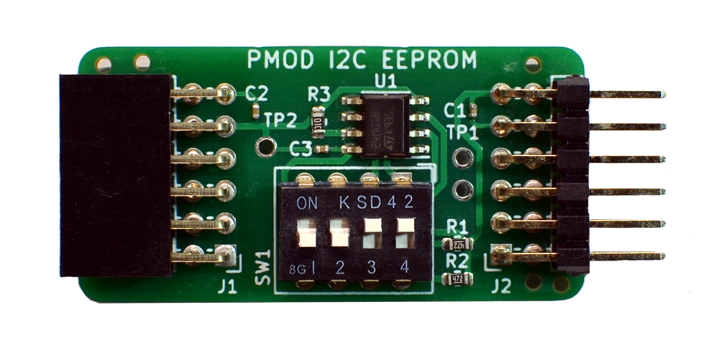
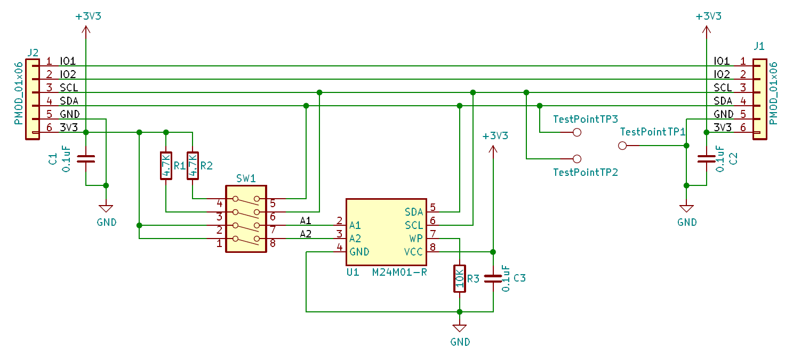
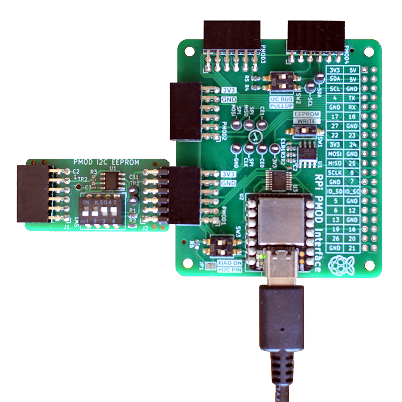

## PMOD-EEPROM


### Description



This I2C PMOD provides a 1 Mbit serial EEPROM, using the M24M01 circuit by STMicroelectronics. DIP switches enable I2C pull-up resistors if needed, and change the EEPROM's I2C device address. Up to four modules can be chained for a total capacity of 4 Mbit (512 KBytes). Three Testpoints can be fitted for I2C bus troubleshooting. The PMOD has designs for Type-6 (I2C single row), and for the new Type-6A (I2C extended double row). The picture shows the Type-6A variant (engineering sample).

http://fpga.fm4dd.com/

### Schematic
This is the schema for the PMOD I2C Type-6 (single row) connector variant:
[](images/eeprom-schema.png)

The current EEPROM desin is pulling the "write-protect" pin high for "read-write" operation. A design update may implement a solder pad for setting the EEPROM 'read-only' after programming.

### Hardware Release

|Type     | Version | Gerber | Schema |
|---------|---------|--------|--------|
|Type-6   |1.1      |[EEPROM PMOD Type-6 Gerber V1.1](release/t6-v11/20210917-eeprom-t6-gerber-v11.zip) | [20210917-eeprom-t6-schema-v11.pdf](release/t6-v11/20210917-eeprom-t6-schema-v11.pdf)
|Type-6A  |1.1      |[EEPROM PMOD Type-6A Gerber V1.1](release/t6a-v11/20210814-eeprom-t6a-gerber-v11.zip) | [20210814-eeprom-t6a-schema-v11.pdff](release/t6a-v11/20210814-eeprom-t6a-schema-v11.pdf)

#### Rasperry Pi I2C Discovery

Ensure the I2C bus is enabled, and install prerequisite I2C tools:
```
# sudo apt-get install git i2c-tools
# raspi-config  2 Interface Options  enable I2C
```

Check the IO expander circuit is visible on the I2C bus under address 0x50..0x56, depending on the address set through the DIP switch. Below example address 0x50/51 is set with SW1-1 = off and SW1-2 = off.
```
pi@pi-ms05:~ $ i2cdetect -y 1
     0  1  2  3  4  5  6  7  8  9  a  b  c  d  e  f
00:          -- -- -- -- -- -- -- -- -- -- -- -- --
10: -- -- -- -- -- -- -- -- -- -- -- -- -- -- -- --
20: -- -- -- -- -- -- -- -- -- -- -- -- -- -- -- --
30: -- -- -- -- -- -- -- -- -- -- -- -- -- -- -- --
40: -- -- -- -- -- -- -- -- -- -- -- -- -- -- -- --
50: 50 51 -- -- -- -- -- -- -- -- -- -- -- -- -- --
60: -- -- -- -- -- -- -- -- -- -- -- -- -- -- -- --
70: -- -- -- -- -- -- -- --
```

### Example code

pmod-eeprom code examples for Arduino boards are available in the [example folder](examples/)

On the Raspberry Pi, the PMOD can be easily programmed with the eeprom utility program 'eepflash.sh'. This program writes a manually created byte file (.eep) as content into the I2C eeprom. It can be found as part of the Raspberry Pi foundation 'hats' repository:
```
pi@pi-ms05:~ $ git clone https://github.com/raspberrypi/hats.git
Cloning into 'hats'...
remote: Enumerating objects: 565, done.
remote: Counting objects: 100% (95/95), done.
remote: Compressing objects: 100% (61/61), done.
remote: Total 565 (delta 59), reused 46 (delta 34), pack-reused 470
Receiving objects: 100% (565/565), 306.34 KiB | 936.00 KiB/s, done.
Resolving deltas: 100% (325/325), done.
```

Compile the tools located in the eepromutils subdirectory:
```
pi@pi-ms05:~ $ cd hats/eepromutils/
pi@pi-ms05:~/hats/eepromutils $ make clean; make
rm -f eepmake eepdump
cc -Wall -Wextra eepmake.c -o eepmake
cc -Wall -Wextra eepdump.c -o eepdump
```
Check the tools:
```
pi@pi-ms05:~/hats/eepromutils $ ls -l
total 84
-rwxr-xr-x 1 pi pi 12820 Aug 28 22:38 eepdump
-rw-r--r-- 1 pi pi  8112 Aug 28 22:37 eepdump.c
-rwxr-xr-x 1 pi pi  3906 Aug 28 22:37 eepflash.sh
-rwxr-xr-x 1 pi pi 22232 Aug 28 22:38 eepmake
-rw-r--r-- 1 pi pi 15144 Aug 28 22:37 eepmake.c
-rwxr-xr-x 1 pi pi  3122 Aug 28 22:37 eeprom_settings.txt
-rw-r--r-- 1 pi pi  2395 Aug 28 22:37 eeptypes.h
-rw-r--r-- 1 pi pi   677 Aug 28 22:37 Makefile
-rw-r--r-- 1 pi pi  1836 Aug 28 22:37 README.md
```

Example upload of an .eep file:
```
pi@pi-ms05:~/hats/eepromutils $ sudo ./eepflash.sh -w -f=rpi2pmod.eep -t=24c32 -d=1 -a=50
This will attempt to talk to an eeprom at i2c address 0x50 on bus 1. Make sure there is an eeprom at this address.
This script comes with ABSOLUTELY no warranty. Continue only if you know what you are doing.
Do you wish to continue? (yes/no): yes
Writing...
0+1 records in
0+1 records out
113 bytes copied, 0.728222 s, 0.2 kB/s
Closing EEPROM Device.
Done.
```



PMOD-EEPROM on a PMOD2RPI interface board, running code from the XIAO Cortex M0+ MCU.
